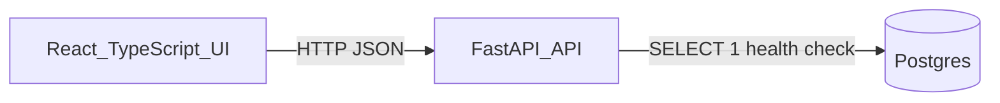
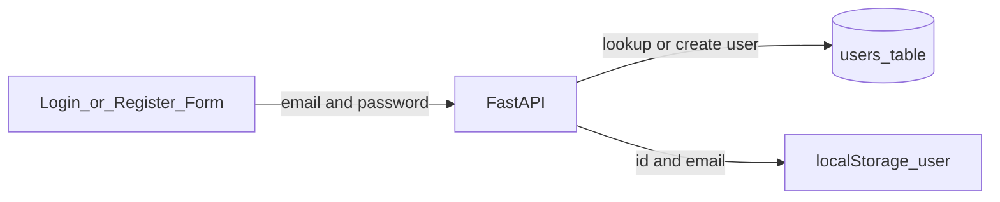

# Project Notes

This file is the working record for progress, engineering decisions, trade-offs, and follow-up items as the take-home evolves. It is intentionally separate from the final `README.md`/`WRITEUP.md` so it can stay candid and incremental while we build.

## Assignment Summary

Build a small full-stack application where users can:

- Register, log in, and log out.
- Manage a private watchlist of up to ten stock tickers.
- View the last seven days of price history at 5-minute granularity for each watched ticker.
- Keep accounts and watchlists persisted across restarts.
- Run the whole app locally via Docker.

Required stack choices for this implementation:

- Backend: Python with FastAPI.
- Database: Postgres.
- Frontend: React with TypeScript.
- Local runtime: Docker Compose.
- Price data: `yfinance`.

## Incremental Build Strategy

The goal is not to build the final app in one shot. Each increment should leave the repo in a runnable, explainable state.


| Increment | Goal                                                                 | Status      |
| --------- | -------------------------------------------------------------------- | ----------- |
| 1         | Dockerized skeleton with FastAPI, React, Postgres, and health checks | Complete    |
| 2         | Persisted users, password hashing, lightweight login, and auth UI    | Complete    |
| 3         | Private watchlist CRUD with max-ten and duplicate validation         | Complete    |
| 4         | `yfinance` price history endpoint and UI display states              | Complete    |
| 5         | UI polish, line chart, sparklines, and finance-app design pass       | Complete    |
| 6         | Focused tests and final manual verification                          | Not started |
| 7         | Final README/WRITEUP for submission                                  | Not started |


## Current Architecture




Current files:

- `docker-compose.yml`: orchestrates Postgres, backend, and frontend.
- `.env.example`: documents local environment variables.
- `backend/app/main.py`: FastAPI application, CORS, request logging, and `/health`.
- `frontend/src/main.tsx`: React entry point and service health UI.
- `README.md`: current run and verification commands.

## Engineering Decisions

### Monorepo With Three Top-Level Services

Decision: keep backend and frontend in one repository under `backend/` and `frontend/`, with Docker Compose at the root.

Reasoning:

- The take-home is small and benefits from simple local setup.
- A reviewer can understand the whole system from the root directory.
- Compose can wire service names, ports, and environment variables without extra tooling.
- This avoids premature deployment-oriented structure while still leaving room to grow.

Trade-off:

- A larger production app might split deployment artifacts, shared tooling, or infrastructure into more formal packages. That is unnecessary for the four-hour scope.

### Docker Compose First

Decision: make Docker Compose the primary local runtime from Increment 1.

Reasoning:

- Docker is an explicit requirement.
- Starting with Compose catches service-boundary issues early: ports, CORS, database hostnames, and environment variables.
- It gives the reviewer one command to run the app.

Trade-off:

- Local development can be slightly slower than running processes directly, but consistency matters more for this submission.

### FastAPI Backend With Async Postgres Driver

Decision: use FastAPI with SQLAlchemy async engine and `asyncpg`.

Reasoning:

- FastAPI gives a small, typed API surface and automatic OpenAPI docs.
- SQLAlchemy is widely understood and will support the auth/watchlist models in later increments.
- Using `asyncpg` keeps the database path compatible with async FastAPI handlers.

Trade-off:

- Async SQLAlchemy adds some complexity. For this project it is acceptable because the code remains small, and it avoids mixing sync database calls into async request handlers.

### Health Endpoint Checks Database Connectivity

Decision: `GET /health` returns both app health and database health.

Reasoning:

- Increment 1 needs to verify the full Docker wiring, not just that Python started.
- The frontend can show whether the backend and Postgres are reachable.
- It creates a useful baseline for future debugging.

Current shape:

```json
{"status":"ok","database":"ok"}
```

Trade-off:

- The endpoint currently returns HTTP 200 even if the database check fails and reports `"database": "error"`. That is fine for a developer-facing skeleton. Before production, liveness and readiness checks should likely be split with more precise status codes.

### React TypeScript With Vite

Decision: use React TypeScript and Vite for the frontend.

Reasoning:

- The user requested React TypeScript.
- Vite is lightweight and fast to scaffold manually.
- It keeps Increment 1 focused on a real browser surface without introducing routing or state libraries prematurely.

Trade-off:

- React does not impose app structure by default. As the app grows, we should add only the folders we need: API client, auth state, pages/components.

### Minimal Dependencies Up Front

Decision: add only the dependencies needed for Increment 1.

Reasoning:

- Keeps the initial system easy to explain.
- Reduces time spent debugging unrelated library setup.
- Lets later increments justify new libraries when the need appears.

Likely future additions:

- Backend data: `yfinance`, possibly `pandas` via `yfinance` transitive requirements.
- Frontend charting: only if time allows and it improves clarity.
- Tests: `pytest`, `httpx`, and possibly React test tooling if frontend tests become worthwhile.

### Logging From The Start

Decision: add basic structured-enough request logging in Increment 1.

Reasoning:

- Logging is a requirement.
- Request method, path, status, and duration are enough to debug early development.
- Starting with middleware means later endpoints automatically get baseline request logs.

Trade-off:

- Logs are plain text, not JSON. For a take-home local app that is acceptable. Production notes should mention structured logs and centralized observability.

### Environment Variables Are Explicit

Decision: keep `.env.example` at the root and use Compose interpolation.

Reasoning:

- Reviewers can copy one file and run the stack.
- It makes secrets and service configuration visible without hardcoding every value in application code.
- It keeps local defaults visible and avoids hardcoding configuration in application code.

Trade-off:

- Current example values are local-development defaults, not secure production defaults.

## Increment 1 Progress Check

Completed:

- Root Docker Compose file created.
- Postgres service added with health check and persistent named volume.
- FastAPI backend created with CORS and `/health`.
- Backend checks database connectivity.
- React TypeScript frontend created.
- Frontend calls `/health` and displays service status.
- `.env.example` added.
- `README.md` run instructions added.

Verified:

- `docker compose config` passes.
- `python3 -m py_compile backend/app/main.py` passes.
- `cd frontend && npm install && npm run build` passes.

Not verified yet:

- Full `docker compose up --build` runtime, because Docker daemon was not reachable from the agent environment.

Manual verification commands:

```sh
cp .env.example .env
docker compose up --build
curl http://localhost:8000/health
docker compose ps
```

Expected health response:

```json
{"status":"ok","database":"ok"}
```

## Increment 2 Progress Check

Goal: users can register, log in, log out, and remain identified across browser refresh without implementing production-grade authentication.

Completed:

- Added `users` table with:
  - `id`
  - `email`
  - `password_hash`
  - `created_at`
  - `updated_at`
- Added startup table creation via SQLAlchemy metadata.
- Added salted PBKDF2 password hashing using Python standard library.
- Added endpoints:
  - `POST /auth/register`
  - `POST /auth/login`
- Added frontend register/login form.
- Store returned `{ id, email }` user object in `localStorage`.
- Added logout by clearing local user state.
- Added `backend/scripts/seed.py` to create demo users for local testing.

### Lightweight Auth Decision

Decision: do not add JWTs, server-side sessions, cookies, OAuth, or token refresh for this take-home.

Reasoning:

- The assignment needs register/login/logout behavior and private watchlists, but not production hardening.
- A lightweight identity flow keeps the implementation focused on the core product requirements.
- Passwords are still hashed so the database does not store plaintext passwords.
- Returning a user object gives Increment 3 a simple owner reference for watchlist records.

Current auth flow:




Trade-off:

- This is not secure. In Increment 3, watchlist calls will use the locally stored user ID as the owner reference. That is acceptable for this scoped take-home only and should be called out in the final write-up as something production would replace with real sessions or signed tokens.

Database table:

```text
users
- id string primary key
- email string unique not null
- password_hash string not null
- created_at timestamp
- updated_at timestamp
```

Verification to run:

```sh
docker compose up --build
docker compose exec backend python -m scripts.seed
curl -X POST http://localhost:8000/auth/register \
  -H 'Content-Type: application/json' \
  -d '{"email":"test@example.com","password":"password123"}'
curl -X POST http://localhost:8000/auth/login \
  -H 'Content-Type: application/json' \
  -d '{"email":"test@example.com","password":"password123"}'
```

## Increment 3 Progress Check

Goal: authenticated-by-convention users can manage private watchlists by sending the locally stored user ID with each watchlist request.

Completed:

- Added `watchlist_items` table with:
  - `id`
  - `user_id`
  - `ticker`
  - `created_at`
- Added foreign key from `watchlist_items.user_id` to `users.id`.
- Added unique constraint on `(user_id, ticker)`.
- Added backend endpoints:
  - `GET /watchlist`
  - `POST /watchlist`
  - `DELETE /watchlist/{ticker}`
- Added `X-User-Id` header convention for lightweight ownership.
- Enforced max ten tickers per user on the backend.
- Normalized tickers to uppercase.
- Added dashboard watchlist panel.
- Added frontend add/remove/refresh flows.
- Extended seed data with starter watchlists.

Database table:

```text
watchlist_items
- id string primary key
- user_id string foreign key users.id
- ticker string not null
- created_at timestamp
- unique(user_id, ticker)
```

Verification to run:

```sh
docker compose up --build
docker compose exec backend python -m scripts.seed
curl -X POST http://localhost:8000/auth/login \
  -H 'Content-Type: application/json' \
  -d '{"email":"demo@example.com","password":"password123"}'
curl http://localhost:8000/watchlist \
  -H 'X-User-Id: <user-id-from-login>'
curl -X POST http://localhost:8000/watchlist \
  -H 'Content-Type: application/json' \
  -H 'X-User-Id: <user-id-from-login>' \
  -d '{"ticker":"META"}'
curl -X DELETE http://localhost:8000/watchlist/META \
  -H 'X-User-Id: <user-id-from-login>'
```

## Increment 4 Progress Check (Backend)

Goal: expose price history through `yfinance` while handling empty or failed upstream data gracefully.

Completed:

- Added `yfinance==1.3.0` to backend dependencies.
- Added `backend/app/prices.py` with:
  - Synchronous yfinance call wrapped in `asyncio.to_thread`.
  - 7-day, 5-minute-interval history.
  - Stable response shape with `ticker`, `interval`, `period`, `points`, `warning`.
  - Defensive cleaning of NaN, None, and non-numeric values.
  - Short-lived in-memory cache with 60-second TTL keyed by uppercase ticker.
  - All exceptions caught and surfaced as a `warning` instead of a 500.
- Added endpoint `GET /prices/{ticker}` that reuses ticker validation from the watchlist code path.

Verified:

- Live yfinance call against `AAPL` and `MSFT` returned 546 points each (7 days x 78 5-minute bars).
- Live yfinance call against `NOT_A_REAL_TICKER_ZZZZ` returned `points: []` with a clear warning instead of an error.

### Engineering Decisions

Decision: keep yfinance access behind an internal `prices.py` module rather than scattering it across handlers.

Reasoning:

- Easier to swap providers later if yfinance becomes unreliable.
- One place to centralize caching and error handling.
- The handler stays trivially small and focused on validation and logging.

Decision: never raise on yfinance failures. Always return a 200 response with an empty `points` array and a `warning` string.

Reasoning:

- The frontend can render a clean empty state without special-casing 4xx/5xx responses.
- Upstream flakiness should not look like a backend bug.
- Logs still capture the underlying exception via `logger.exception`.

Decision: cache successful responses for 60 seconds in memory, do not cache warnings.

Reasoning:

- Avoids hammering yfinance during repeated UI refreshes.
- Failures should be retried quickly so transient yfinance issues recover on their own.
- In-memory cache is simple and disappears on restart, which is acceptable for this take-home.

Trade-offs:

- In-memory cache will not be shared across replicas in production. Production notes should cover Redis or a managed cache.
- 60 seconds is a deliberate compromise between freshness and call volume; production code could expose it as configuration.

### Increment 4 Frontend

Completed:

- Watchlist rows are now selectable. Clicking a ticker selects it and reveals the price panel below the watchlist.
- Added `PricePanel` component that fetches `GET /prices/{ticker}` with loading, empty, warning, and error states.
- Added a small summary bar with latest close, latest timestamp, absolute change, and percent change.
- Added a scrollable, sticky-header price table with the most recent 50 of returned points.
- Removing a selected ticker clears the price panel.
- Bumped TypeScript target/libs to ES2022 to use `Array.prototype.at`.

Verification to run:

```sh
docker compose up --build
docker compose exec backend python -m scripts.seed
```

Then in the browser at [http://localhost:5173](http://localhost:5173):

1. Log in as `demo@example.com` / `password123`.
2. Click `AAPL` (or any seeded ticker) to load price history.
3. Click `Refresh` to confirm the cache works.
4. Add a fake ticker like `ZZZZ123` to the watchlist, select it, and confirm the warning state renders without breaking the UI.

## Increment 5 Progress Check (UI Polish)

Goal: turn the dashboard into something that reads as a simple finance app, with a line chart instead of bars and consistent design.

Completed:

- Replaced the bar chart with `PriceLineChart`: a stroked line plus gradient-filled area, tone-driven color (green, red, gray), latest-point dot, and unobtrusive grid and axis labels.
- Added `Sparkline` for inline mini-charts on each watchlist row.
- Restructured the `PricePanel` into a finance-app hero header: ticker symbol, large price, signed absolute and percent change, "as of" timestamp, refresh and close actions.
- Replaced the four-tile change summary with a per-period `Open / High / Low / Close / Volume` stat strip drawn from the latest point.
- Moved the recent prints table behind a collapsible `<details>` to keep the chart and stats above the fold.
- Reorganized the app shell. When a user is logged in, the page now shows a brand header (`Imperial Capital - Watchlist`) with signed-in email, log-out button, and a compact health status strip. The marketing hero remains for the logged-out auth view.
- Standardized design tokens via CSS variables: surface colors, borders, text shades, up/down/flat tones, radii, and shadows. Buttons now have a clear primary, `secondary`, and `ghost` variant.
- Tabular numerics across price displays for easier visual comparison.
- Improved selected-row treatment, sparkline alignment, and responsive layout below 820px.

Trade-offs:

- Pure SVG chart with no charting library. Easy to read and explain, but lacks interactive crosshair, axes, or zooming.
- Recent prints are hidden by default. A reviewer who wants the raw rows still has them, but they no longer dominate the screen.
- The sparkline samples roughly every Nth point to stay snappy. Production would render the full series via a charting library or memoized canvas.

Verification to run:

```sh
docker compose up --build
docker compose exec backend python -m scripts.seed
```

Then in the browser at [http://localhost:5173](http://localhost:5173):

1. Log in as `demo@example.com` / `password123`.
2. Confirm the brand header, status strip, and inline sparklines render.
3. Click `AAPL` (or another seeded ticker) and confirm the hero price, signed change, line + area chart, OHLCV stat row, and collapsible recent-prints table.
4. Click `Refresh prices` to confirm the parallel reload still works.
5. Add an unknown ticker like `ZZZZ123`, select it, and confirm the warning state renders cleanly with no hero crash.

## Modularity Refactor (post-Increment 5)

Goal: split the two monolith files (`backend/app/main.py` at ~300 lines and
`frontend/src/main.tsx` at ~933 lines) into feature-scoped modules so each
file has a single, obvious responsibility.

### Backend changes

- `app/main.py` shrank from 300 to 68 lines. It is now an app factory that
configures middleware, lifespan, and router includes only.
- New modules:
  - `app/config.py` — typed `Settings` loaded from env.
  - `app/logging_config.py` — shared logger and `configure_logging()`.
  - `app/database.py` — async engine, `SessionLocal`, declarative `Base`.
  - `app/security.py` — password hashing and string normalisation (pure
  helpers with no FastAPI imports, easy to unit test).
  - `app/validation.py` — request validators that raise HTTP 400.
  - `app/models.py` — `User` and `WatchlistItem` ORM tables.
  - `app/schemas.py` — Pydantic request/response models.
  - `app/deps.py` — shared `get_session` and `get_current_user` deps.
  - `app/routes/{health,auth,watchlist,prices}.py` — APIRouter per concern.
  - `app/services/prices.py` — moved from `app/prices.py`. Same logic.
- `get_current_user` replaces the duplicated `get_user_or_404` calls. Routes
declare `user: User = Depends(get_current_user)` and never have to look up
the row themselves.
- Routes also use a shared `session: AsyncSession = Depends(get_session)`
instead of opening their own `async with SessionLocal()` blocks.
- `backend/scripts/seed.py` no longer imports from `app.main`. It pulls
helpers directly from `database`, `models`, `security`, `logging_config`.

### Frontend changes

- `src/main.tsx` shrank from 933 to 10 lines (just the React mount). All
app logic moved to `src/App.tsx`.
- New folders:
  - `src/api/` — `client.ts`, `auth.ts`, `watchlist.ts`, `prices.ts`,
  `health.ts`. All `fetch` calls live here behind named functions.
  - `src/auth/` — `AuthPanel.tsx`, `useUser.ts`, `useHealth.ts`.
  - `src/dashboard/` — `Dashboard.tsx`, `WatchlistPanel.tsx`,
  `PricePanel.tsx`, plus `useWatchlist`/`usePrices` hooks.
  - `src/charts/` — `PriceLineChart.tsx`, `Sparkline.tsx`, `chartUtils.ts`.
  - `src/shared/` — `format.ts`, `StatusPill.tsx`.
  - `src/styles/` — `tokens.css`, `base.css`, `layout.css`, `header.css`,
  `status.css`, `feedback.css`, `auth.css`, `dashboard.css`,
  `watchlist.css`, `price-panel.css`, `responsive.css`, all imported via
  `styles/index.css`.
- `useWatchlist(userId)` owns list/add/remove/state. `usePrices(tickers)`
owns the price-history cache and refresh actions. `Dashboard` becomes a
~50-line composition: it instantiates the two hooks, memoizes the ticker
array, and routes the active selection to either the empty state or the
`PricePanel`.

### Verification

- `python3 -c "ast.parse"` over every backend file succeeds.
- `npx tsc --noEmit` passes.
- `npm run build` produces a working production bundle (`vite build`,
47 modules, ~211 KB JS pre-gzip).
- No behaviour changes intended; routes, payloads, and UI all match.

### Trade-offs

- Pulled `models.py` and `schemas.py` into single files rather than
per-domain folders. Both are small (~40 lines) and it's easy to promote
to folders later when domains grow.
- Kept the in-memory price cache inside `services/prices.py`. A real cache
would be Redis or similar, but the current TTL dict works at this scale.
- `usePrices` watches the `tickers` array reference; `Dashboard` memoizes
it via `useMemo` over `watchlist.items`. Without that, the hook would
re-fetch on every render.

## Next Increment Plan: Logging, Tests, Final Docs

Planned work:

- Tighten backend logging around watchlist add/remove and price warnings.
- Make API error messages consistent across surfaces.
- Add a small set of pytest tests for auth and watchlist privacy/rules.
- Optional: light tests around the price service with yfinance mocked.
- Final README and WRITEUP polish for submission.

## Risks And Watch Items

- `yfinance` can return empty data or fail due to upstream scraping changes. The price increment must handle empty/error states explicitly.
- Watchlist ownership will use the locally stored user ID for this take-home. Document that this is not secure and should be replaced by real auth in production.
- The max-ten ticker rule belongs on the backend, even if the frontend also disables the add form.
- Docker startup order is not a substitute for app-level error handling. The backend should still handle temporary database errors cleanly.
- Keep scope tight. A working vertical slice is more valuable than elaborate charting or broad frontend tests.

## Final Write-Up Material To Preserve

Likely production-readiness notes:

- Use managed Postgres, real migrations, backups, and connection pooling.
- Use stronger auth/session hardening, secret management, refresh-token rotation or server-side sessions, rate limiting, and CSRF protection if cookies are used.
- Replace direct `yfinance` calls with a more reliable market data provider or isolate it behind a provider interface.
- Add caching and background refresh jobs for price data.
- Add structured logs, metrics, tracing, and alerting.
- Add CI/CD, test gates, dependency scanning, and deployment infrastructure.

Likely more-time notes:

- Better charting and symbol search.
- More comprehensive backend and frontend tests.
- Accessibility and responsive design pass.
- Better validation and user-facing error copy.
- More robust price caching and retry behavior.

