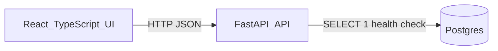

# Project Notes

This file is the working record for progress, engineering decisions, trade-offs, and follow-up items as the take-home evolves. It is intentionally separate from the final `README.md`/`WRITEUP.md` so it can stay candid and incremental while we build.

## Assignment Summary

Build a small full-stack application where users can:

- Register, log in, and log out.
- Manage a private watchlist of up to ten stock tickers.
- View the last seven days of price history at 5-minute granularity for each watched ticker.
- Keep accounts and watchlists persisted across restarts.
- Run the whole app locally via Docker.

Required stack choices for this implementation:

- Backend: Python with FastAPI.
- Database: Postgres.
- Frontend: React with TypeScript.
- Local runtime: Docker Compose.
- Price data: `yfinance`.

## Incremental Build Strategy

The goal is not to build the final app in one shot. Each increment should leave the repo in a runnable, explainable state.


| Increment | Goal                                                                 | Status      |
| --------- | -------------------------------------------------------------------- | ----------- |
| 1         | Dockerized skeleton with FastAPI, React, Postgres, and health checks | Complete    |
| 2         | Persisted users, password hashing, JWT auth, and auth UI             | Not started |
| 3         | Private watchlist CRUD with max-ten and duplicate validation         | Not started |
| 4         | `yfinance` price history endpoint and UI display states              | Not started |
| 5         | Logging polish, consistent errors, and user experience pass          | Not started |
| 6         | Focused tests and final manual verification                          | Not started |
| 7         | Final README/WRITEUP for submission                                  | Not started |


## Current Architecture




Current files:

- `docker-compose.yml`: orchestrates Postgres, backend, and frontend.
- `.env.example`: documents local environment variables.
- `backend/app/main.py`: FastAPI application, CORS, request logging, and `/health`.
- `frontend/src/main.tsx`: React entry point and service health UI.
- `README.md`: current run and verification commands.

## Engineering Decisions

### Monorepo With Three Top-Level Services

Decision: keep backend and frontend in one repository under `backend/` and `frontend/`, with Docker Compose at the root.

Reasoning:

- The take-home is small and benefits from simple local setup.
- A reviewer can understand the whole system from the root directory.
- Compose can wire service names, ports, and environment variables without extra tooling.
- This avoids premature deployment-oriented structure while still leaving room to grow.

Trade-off:

- A larger production app might split deployment artifacts, shared tooling, or infrastructure into more formal packages. That is unnecessary for the four-hour scope.

### Docker Compose First

Decision: make Docker Compose the primary local runtime from Increment 1.

Reasoning:

- Docker is an explicit requirement.
- Starting with Compose catches service-boundary issues early: ports, CORS, database hostnames, and environment variables.
- It gives the reviewer one command to run the app.

Trade-off:

- Local development can be slightly slower than running processes directly, but consistency matters more for this submission.

### FastAPI Backend With Async Postgres Driver

Decision: use FastAPI with SQLAlchemy async engine and `asyncpg`.

Reasoning:

- FastAPI gives a small, typed API surface and automatic OpenAPI docs.
- SQLAlchemy is widely understood and will support the auth/watchlist models in later increments.
- Using `asyncpg` keeps the database path compatible with async FastAPI handlers.

Trade-off:

- Async SQLAlchemy adds some complexity. For this project it is acceptable because the code remains small, and it avoids mixing sync database calls into async request handlers.

### Health Endpoint Checks Database Connectivity

Decision: `GET /health` returns both app health and database health.

Reasoning:

- Increment 1 needs to verify the full Docker wiring, not just that Python started.
- The frontend can show whether the backend and Postgres are reachable.
- It creates a useful baseline for future debugging.

Current shape:

```json
{"status":"ok","database":"ok"}
```

Trade-off:

- The endpoint currently returns HTTP 200 even if the database check fails and reports `"database": "error"`. That is fine for a developer-facing skeleton. Before production, liveness and readiness checks should likely be split with more precise status codes.

### React TypeScript With Vite

Decision: use React TypeScript and Vite for the frontend.

Reasoning:

- The user requested React TypeScript.
- Vite is lightweight and fast to scaffold manually.
- It keeps Increment 1 focused on a real browser surface without introducing routing or state libraries prematurely.

Trade-off:

- React does not impose app structure by default. As the app grows, we should add only the folders we need: API client, auth state, pages/components.

### Minimal Dependencies Up Front

Decision: add only the dependencies needed for Increment 1.

Reasoning:

- Keeps the initial system easy to explain.
- Reduces time spent debugging unrelated library setup.
- Lets later increments justify new libraries when the need appears.

Likely future additions:

- Backend auth/passwords: `passlib[bcrypt]`, `python-jose` or `PyJWT`, `python-multipart` if form login is used.
- Backend data: `yfinance`, possibly `pandas` via `yfinance` transitive requirements.
- Frontend charting: only if time allows and it improves clarity.
- Tests: `pytest`, `httpx`, and possibly React test tooling if frontend tests become worthwhile.

### Logging From The Start

Decision: add basic structured-enough request logging in Increment 1.

Reasoning:

- Logging is a requirement.
- Request method, path, status, and duration are enough to debug early development.
- Starting with middleware means later endpoints automatically get baseline request logs.

Trade-off:

- Logs are plain text, not JSON. For a take-home local app that is acceptable. Production notes should mention structured logs and centralized observability.

### Environment Variables Are Explicit

Decision: keep `.env.example` at the root and use Compose interpolation.

Reasoning:

- Reviewers can copy one file and run the stack.
- It makes secrets and service configuration visible without hardcoding every value in application code.
- It prepares the auth increment by reserving `JWT_SECRET`.

Trade-off:

- Current example values are local-development defaults, not secure production defaults.

## Increment 1 Progress Check

Completed:

- Root Docker Compose file created.
- Postgres service added with health check and persistent named volume.
- FastAPI backend created with CORS and `/health`.
- Backend checks database connectivity.
- React TypeScript frontend created.
- Frontend calls `/health` and displays service status.
- `.env.example` added.
- `README.md` run instructions added.

Verified:

- `docker compose config` passes.
- `python3 -m py_compile backend/app/main.py` passes.
- `cd frontend && npm install && npm run build` passes.

Not verified yet:

- Full `docker compose up --build` runtime, because Docker daemon was not reachable from the agent environment.

Manual verification commands:

```sh
cp .env.example .env
docker compose up --build
curl http://localhost:8000/health
docker compose ps
```

Expected health response:

```json
{"status":"ok","database":"ok"}
```

## Next Increment Plan: Auth

Goal: users can register, log in, log out, and remain authenticated across browser refresh.

Planned backend work:

- Add `User` model with email, hashed password, and timestamps.
- Add database initialization or migrations.
- Add password hashing.
- Add JWT creation and auth dependency.
- Add endpoints:
  - `POST /auth/register`
  - `POST /auth/login`
  - `GET /auth/me`

Planned frontend work:

- Add login/register forms.
- Store token client-side for the take-home scope.
- Add authenticated/unauthenticated UI states.
- Add logout button that clears local auth state.

Key decisions to revisit during Increment 2:

- Whether to use Alembic or startup `create_all`. Default for speed: startup `create_all`, with production notes explaining migrations.
- Whether login should accept JSON or OAuth2 form data. Default for frontend simplicity: JSON.
- Whether token storage should be `localStorage` or an HTTP-only cookie. Default for take-home speed: `localStorage`, with production notes explaining cookie/session hardening.

## Risks And Watch Items

- `yfinance` can return empty data or fail due to upstream scraping changes. The price increment must handle empty/error states explicitly.
- Watchlist privacy should always derive `user_id` from the authenticated token, never from request body data.
- The max-ten ticker rule belongs on the backend, even if the frontend also disables the add form.
- Docker startup order is not a substitute for app-level error handling. The backend should still handle temporary database errors cleanly.
- Keep scope tight. A working vertical slice is more valuable than elaborate charting or broad frontend tests.

## Final Write-Up Material To Preserve

Likely production-readiness notes:

- Use managed Postgres, real migrations, backups, and connection pooling.
- Use stronger auth/session hardening, secret management, refresh-token rotation or server-side sessions, rate limiting, and CSRF protection if cookies are used.
- Replace direct `yfinance` calls with a more reliable market data provider or isolate it behind a provider interface.
- Add caching and background refresh jobs for price data.
- Add structured logs, metrics, tracing, and alerting.
- Add CI/CD, test gates, dependency scanning, and deployment infrastructure.

Likely more-time notes:

- Better charting and symbol search.
- More comprehensive backend and frontend tests.
- Accessibility and responsive design pass.
- Better validation and user-facing error copy.
- More robust price caching and retry behavior.

